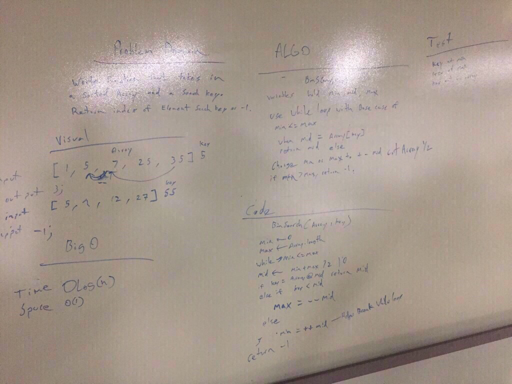

# Reverse Array.

## Challenge
 - Write a function called BinarySearch which takes in 2 parameters: a sorted array and the search key. -Without utilizing any of the built
 - in methods available to your language, return the index of the array’s element that is equal to the search key, or -1 if the element does not exist.

 - Input [4, 7, 10, 15, 27, 30], 27.   Output 4 
 - Input [13, 18, 27, 30, 35] 16.  Output -1

## Solution

```# Reverse Array

- [x]  Do all your work in a public repository called data-structures-and-algorithms, with a well-formatted, detailed top-level README.md
- [x] Create a branch in your repository called array_binary_search
- [x] On your branch, create a file called array_binary_search.js
- [x] Include any language-specific configuration files required for this challenge to become an individual component, module, library, etc.
- [x] Write a function called BinarySearch which takes an array and a key as arguments.
Without utilizing any of the built-in library methods available to your language, return the index position of element that is equal to key or -1 if element is not in array.
- [x] Take a photo of your completed whiteboard, matching the example whiteboard layout.
- [x] Copy your photo into an /assets directory in your repo
- [x] Give the image file the same name as the branch you are working on
- [x] Embed the image in your README.md documentation
- [x] Create a pull request from your branch to your master branch
- [x] In your open pull request, leave as a comment a checklist of the specifications and tasks above, with the actual steps that you completed checked off
- [x] Copy the link to your open pull request and paste it into the corresponding Canvas assignment
- [x] Leave a description of how long this assignment took you in the comments box
- [x] Add any additional comments you like about your process or any difficulties you may have had with the assignment
- [x] Merge your branch into master, and delete your branch ```
