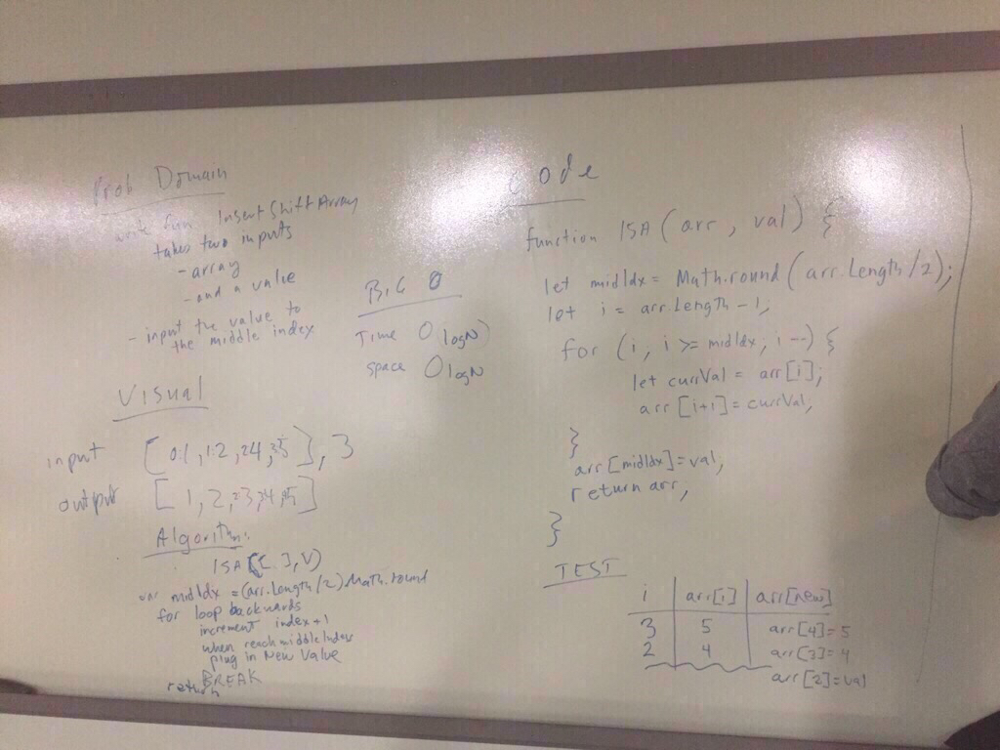

# Shift Array.

## Challenge
-Write a function called insertShiftArray which takes in an array and the value to be added. -Without utilizing any of the built-in methods available to your language, return an array with the new value added at the middle index.

 - Input [2, 4, 6, 8], 5.  Output [2, 4, 5, 6, 8]
 - Input [A, B, D, E], C.  Output [A, B, C, D, E]

## Solution

```# Reverse Array

- [x]  Do all your work in a public repository called data-structures-and-algorithms, with a well-formatted, detailed top-level README.md
- [x] Create a branch in your repository called array_shift
- [x] On your branch, create a file called array_shift.js
- [x] Include any language-specific configuration files required for this challenge to become an individual component, module, library, etc.
- [x] Write a function called insertShiftArray which takes an array as an argument.
Without utilizing any of the built-in library methods available to your language, return a set of values found in both trees.
- [x] Take a photo of your completed whiteboard, matching the example whiteboard layout.
- [x] Copy your photo into an /assets directory in your repo
- [x] Give the image file the same name as the branch you are working on
- [x] Embed the image in your README.md documentation
- [x] Create a pull request from your branch to your master branch
- [x] In your open pull request, leave as a comment a checklist of the specifications and tasks above, with the actual steps that you completed checked off
- [x] Copy the link to your open pull request and paste it into the corresponding Canvas assignment
- [x] Leave a description of how long this assignment took you in the comments box
- [x] Add any additional comments you like about your process or any difficulties you may have had with the assignment
- [x] Merge your branch into master, and delete your branch ```

#Stretch Goal
- Write a second function that removes an element from the middle index and shifts other elements in the array to fill the new gap.